# Behaviour-Driven Development for Better Software Products


## Why

We need to minimise the friction caused by misunderstandings between the software development team and those responsible for the software requirements by proposing an innovative approach to software specification. The **Behaviour-Driven Development** technique promotes a shared understanding and holds each stakeholder — the product owner, software engineer and test engineer — accountable for the quality of the delivered increments.

## Structure

- The **first part** sets the current context by outlining the traditional approach based on the usual agile tools and roles, and by illustrating some issues and suggesting remedies.
- The **second part** outlines Behaviour-Driven Development (BDD) as a recognised software crafting technique that can address the issues listed.
- The **third part** explains the concrete implementation of this technique.
- The **fourth part** provides immediately usable material for trying it out.

## Part 1 — The traditional approach

### Backlog building

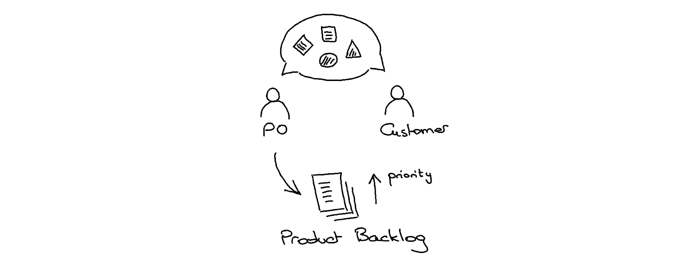

The product owner listens to customer needs; the product owner owns and manages a product backlog composed of features that extend the current product capabilities or current system behaviour.

### Features understanding

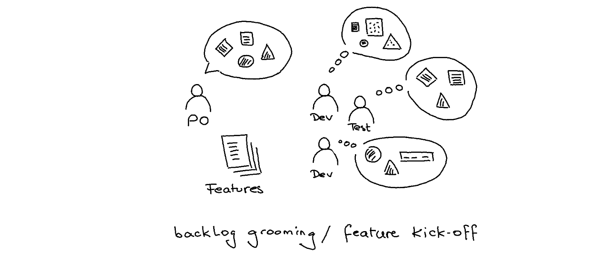

The product owner explains the expected system behaviour to software and test engineers; they try to align their understanding with the product owner's vision, challenging them with their perspective during backlog grooming or feature kick-off sessions.

### Software delivery

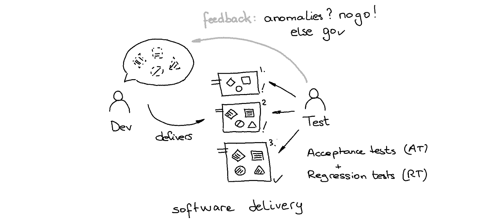

The test engineer verifies every delivered functional increment; they check its completeness and correctness and, with best effort, its absence of regression. Anomalies are returned to the development team for the next delivery.

### Weaknesses and remedies

#### Anomalies

Anomalies due to misalignments or lack of quality in the realisation can cause time-consuming ping-pong loops.

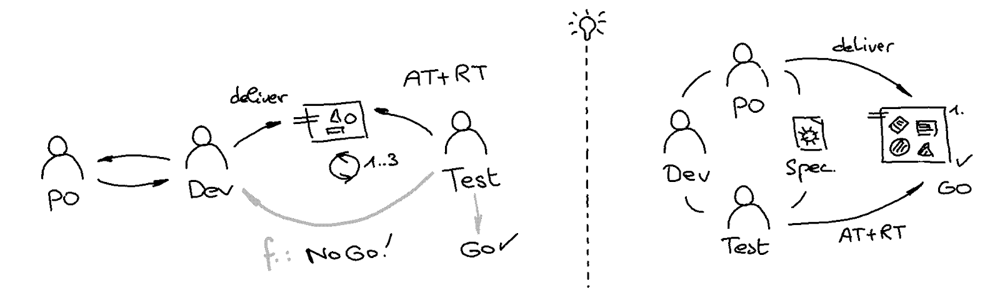

> 💡 Could an innovative approach that re-establishes a contractual element encourage greater accountability of each stakeholder for the quality of delivery?

#### Cost of regression tests

The testing activity usually focuses on checking newly added features and regressions. Regression testing is time-consuming and should be automated, or, unfortunately, may be reduced to only the most essential features.

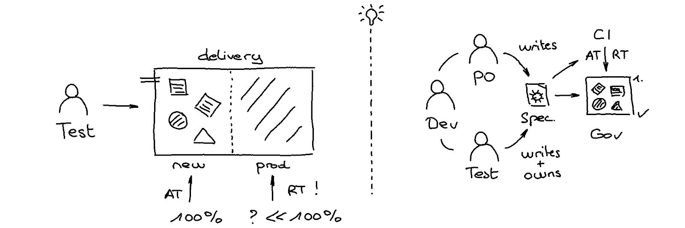

> 💡 Could we innovate on the tester's activity by automating it and giving it more impact upstream?

#### Loss of trust

Anomalies, regressions, and misalignments can negatively impact the already established trust in the product itself, both within and outside the product team.

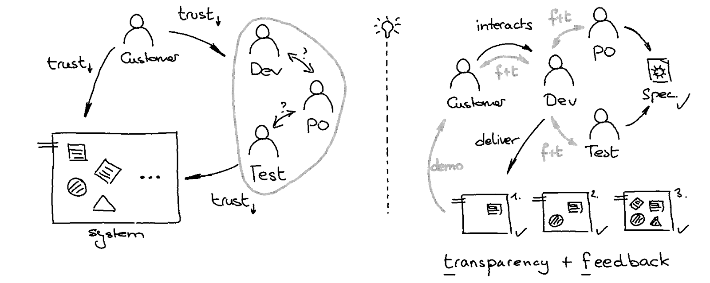

> 💡 Could a collaborative approach that promotes shared accountability, transparency and regular feedback during implementation build trust?

#### Tunnel effect

The absence of continuous delivery means less feedback and, consequently, fewer opportunities to respond to any misalignment.

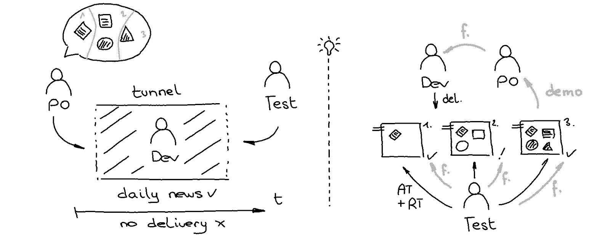

> 💡 Could the division of a feature into several deliverables containing one or more scenarios facilitate deliveries and thus feedback possibilities?

#### Lack of documentation

What does the system solve? What are the features? What are the nominal and edge scenarios? What about testing evidence?

The [Manifesto for Agile Software Development](https://agilemanifesto.org/) prioritises working software over comprehensive documentation. Therefore, the sources of documentation on what the developed system solves are production code, test code, and mental knowledge, often distributed across these. Consequently, more pressure is put on well-crafted code. In addition, narrative documentation sources can still be valuable for setting the context, but they are usually written at a high level and may no longer reflect the behaviour of the completed system.

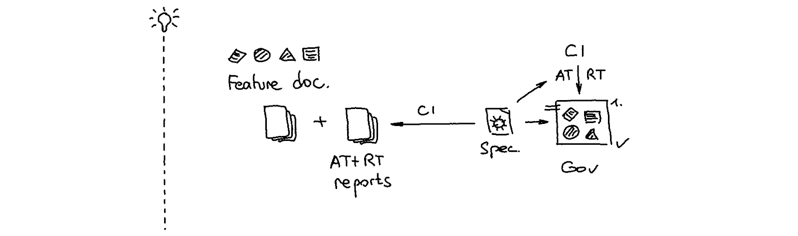

> 💡 Could a collaborative approach restore a lightweight, human-readable digital artefact that contractually formalises common understanding and be a source of living documentation that provides features and testing evidence?

## Part 2 — Behaviour-Driven Development

**Behaviour-Driven Development** (BDD) is a software development technique with the central promise of facilitating shared understanding and optimising the functional quality of software deliveries.


### Secure software development

This technique helps develop the right thing securely, i.e., the expected system behaviour, correct and complete, without causing functional regression.

### Contract-driven

This technique proposes a context for the **collaborative specification**, aiming to establish a shared understanding of the expected system behaviour and formalise it as a readable, **executable specification** on which acceptance tests can be defined.

### Domain-driven

The issued specification artefact uses a natural-language, domain-specific vocabulary that every stakeholder understands: product person, software engineers, and QA engineers.

### Documentation-driven

This artefact, written in [Gherkin](https://cucumber.io/docs/gherkin/) syntax, explains the system behaviour using examples grouped into scenarios that describe the system use cases and business rules.

Here is an example that uses a generic scenario to describe the behaviour of a problem-solving function; the Examples section defines the input and output values:

```gherkin
Feature: To mumble the letters of a text
  # See https://learn.madetech.com/katas/mumbling/

  Scenario Outline: Split a given text, repeating the letters, and capitalising the first occurrence only

    When mumbling <text>
    Then the result of mumbling is <result>
    Examples:
      | text   | result                     |
      | -      | -                          |
      | A      | A                          |
      | a      | A                          |
      | ab     | A-Bb                       |
      | abc    | A-Bb-Ccc                   |
      | abC    | A-Bb-Ccc                   |
      | aBCd   | A-Bb-Ccc-Dddd              |
      | QWERTY | Q-Ww-Eee-Rrrr-Ttttt-Yyyyyy |
```

More BDD scenarios: [Blueprint API](https://github.com/vondacho/arch-blueprint-kotlin/tree/master/src/acceptanceTest/resources/features)

### Test-driven

Coupled with **Acceptance Test-Driven Development** (ATDD), an outside-in software development technique, the software engineer automates test cases and can drive them to completeness, correctness, and the absence of functional regression during a feature increment.

BDD was initially introduced in 2003 by Dan North as a response to test-driven development (TDD), including acceptance testing or customer test-driven development practices found in extreme programming.

### Shift-left

BDD enables modern software development and promotes a shift-left approach in which both the developer and the QA engineer contribute their perspectives to acceptance scenario mapping. The QA engineer's role can now better influence the completeness and the correctness of every delivery. The developer's role should leverage this partnership with the QA engineer to strengthen its test-first approach.

## Part 3 — BDD in practice

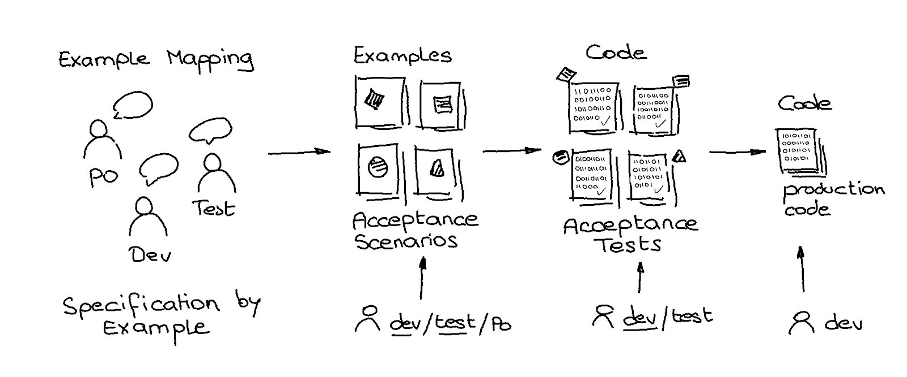

A specification-by-example activity facilitates a common understanding of expected behaviour through examples. It applies to a wide range of use cases across any domain: calculation, aggregation, orchestration, eventing, management, and workflow.

- The **Specification-by-Example** activity is conducted during **Example Mapping** sessions.
- Formalisation of expected system behaviour is achieved through **acceptance scenarios** expressed in the domain language and formalised using [Gherkin](https://cucumber.io/docs/gherkin/) syntax.
- It requires practice; finding good wording has to be learned by doing. Efficient wording can be easily understood, validated, and automated.
- Automated testing means developing **automated acceptance tests** using glue code.
- The development of production code is then driven by existing acceptance tests (ATDD).

### Three amigos

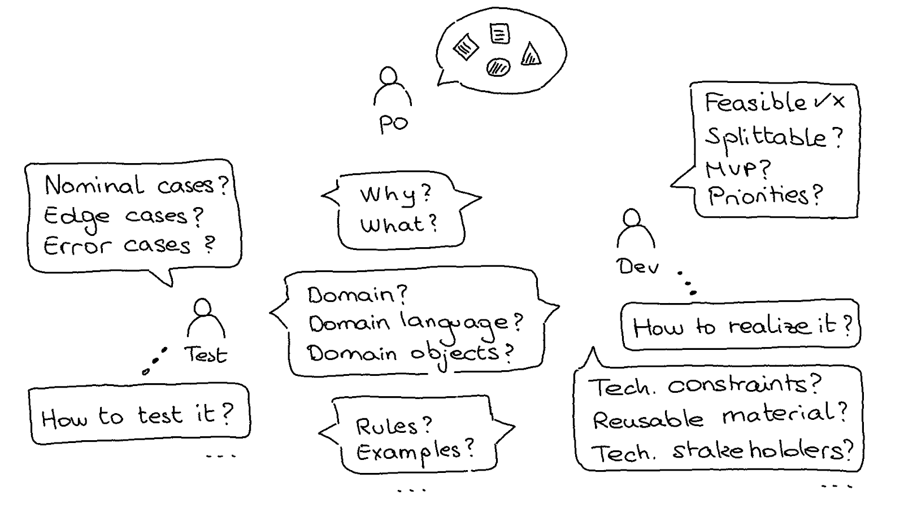

The conversations in the Specification by Example activity result from the interaction of three actors with different perspectives, brought together for the same purpose: the product person or domain expert, the software engineer, and the test engineer.

### Example Mapping

An Example Mapping session facilitates **structured conversations** between the three amigos. It allows identifying user stories, open questions, business rules, and examples.

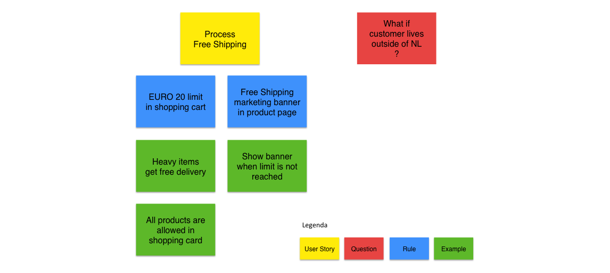

See [Example Mapping: steering the conversation](https://xebia.com/blog/example-mapping-steering-the-conversation/).

#### Feature, story, business rule, scenario, example

- One **feature** is explained by one or more **scenarios** grouped in **stories**.
- One story usually groups one or more scenarios and represents a feature increment with business value.
- One or more scenarios or examples typically support a single **business rule**.
- One or more **examples** support one scenario.
- One scenario for each nominal case.
- One scenario for each edge case.
- One scenario for each negative or error case.

### Scenarios writing

Writing scenarios helps build a common, ubiquitous language that everyone can understand and validate.

As it requires some experience and a particular way of thinking, it is recommended that the test engineer or the software engineer perform this activity. Feedback from the product person can be done once they have drafted the [Gherkin](https://cucumber.io/docs/gherkin/) specification.

A scenario consists of a set of preconditions about the initial state or context, a set of actions (usually one), and a set of assertions (or postconditions) about the final state or context.

#### Functional scenarios

```gherkin
Feature: To be able to manage a set of existing clients in a persistent way

  Background:
    Given the following set of existing clients
      | model-id | id                                   | name    | age | creation-date       |
      | 1        | ce751f30-217a-422c-b81b-8f75df4917b6 | client1 | 21  | 2020-10-10T12:00:00 |
      | 2        | 29e364b9-f5ef-43d9-9f30-e07a30b73e01 | client2 | -   | 2020-10-09T12:00:00 |

  Rule: An existing client is a persisted resource in the system.

    Scenario: Add a new client to the existing clients

      Given the following set of client attributes
        | name | age |
        | test | 22  |
      And the next identifier is afd9ce9f-ee0e-4547-8c77-3cc43ec85dbc
      And the next timestamp is 2020-10-11T12:00:00
      When registering the new client
      Then the response status is CREATED
      And the attributes of the returned client are the following
        | id                                   | name | age | creation-date       |
        | afd9ce9f-ee0e-4547-8c77-3cc43ec85dbc | test | 22  | 2020-10-11T12:00:00 |
      And the returned client is added to the set of existing clients
```

#### Non-functional scenarios (NFR)

```gherkin
Feature: To be able to manage a set of existing clients in a persistent way

  Background:
    Given the following set of existing clients
      | model-id | id                                   | name    | age | creation-date       |
      | 1        | ce751f30-217a-422c-b81b-8f75df4917b6 | client1 | 21  | 2020-10-10T12:00:00 |
      | 2        | 29e364b9-f5ef-43d9-9f30-e07a30b73e01 | client2 | -   | 2020-10-09T12:00:00 |

  Rule: An existing client is a persisted resource in the system.

    Scenario: Add a new client to the existing clients

      Given the following set of client attributes
        | name | age |
        | test | 22  |
      And the next identifier is afd9ce9f-ee0e-4547-8c77-3cc43ec85dbc
      And the next timestamp is 2020-10-11T12:00:00
      When registering the new client
      Then the response status is CREATED
      And the attributes of the returned client are the following
        | id                                   | name | age | creation-date       |
        | afd9ce9f-ee0e-4547-8c77-3cc43ec85dbc | test | 22  | 2020-10-11T12:00:00 |
      And the returned client is added to the set of existing clients
```

More scenarios: [Blueprint API](https://github.com/vondacho/arch-blueprint-kotlin/tree/master/src/acceptanceTest/resources/features/client)

### Scenarios validation

Every scenario has to be validated by every stakeholder or amigo, so that it describes an expected facet of the system behaviour. As a result, shared understanding is materialised into a digital set of acceptance scenarios that establishes a **digital contract** between all stakeholders.

These acceptance scenarios form the foundation of an executable specification and the building blocks for defining **acceptance tests**.

### Acceptance testing

Acceptance tests support high-level **functional and non-functional** testing, including testing new feature increments and regression testing.

This activity is usually done by a test engineer of a quality assurance team to validate a delivered feature increment before its deployment to production. BDD promotes a shift-left approach, making both the developer and QA engineer roles accountable for acceptance testing.

### ATDD

ATDD is a test-driven development technique based on acceptance tests, used by software engineers to drive development toward the expected system behaviour.

> Given an acceptance scenario, a failing acceptance test is written first, and the software engineer writes the minimal production code to pass it. This process is repeated with the next acceptance scenario, along with a refactoring phase applied to both test and production code to ensure well-crafted code and design.

This cycle executed at the feature level may include an inner TDD cycle at the component level; this technique is called Outside-in TDD.

### BDD and ATDD

ATDD is used with BDD to automate acceptance scenarios; each scenario corresponds to a single acceptance test.

### BDD glue code, test code, and production code

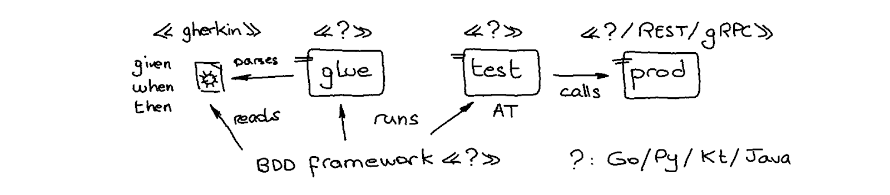

- The test code implements acceptance tests and interacts with the production code.
- BDD glue code implements the mapping of BDD steps written in natural language into test code.
- BDD steps are mapped by BDD glue code into test code written in a given technology.
- BDD frameworks (Cucumber, Behave) traverse test steps and automate test execution.

```kotlin
@When("mumbling {word}") // glue code
fun mumble(text: String) { // glue code
    TestContext.put("mumbling.result", // test code
        MumblingStrategy().mumble(text)) // test code calls production code
}

@Then("the result of mumbling is {word}") // glue code
fun mumblingResultIs(expected: String) { // glue code
    val result: String = TestContext.at("mumbling.result") // test code
    assertThat(result).isEqualTo(expected) // test code
}
```

More glue code: [Blueprint API](https://github.com/vondacho/arch-blueprint-kotlin/tree/master/src/acceptanceTest/kotlin/edu/obya/blueprint/client/at/steps)

### BDD with acceptance tests

#### Scope

Well-written BDD scenarios are written in a naturally high-level domain language. One scenario could be automated to target either a user interacting with a front-end application, a web API, or a component that supports application or domain logic. A specific glue code developed for each target enables this decoupling.

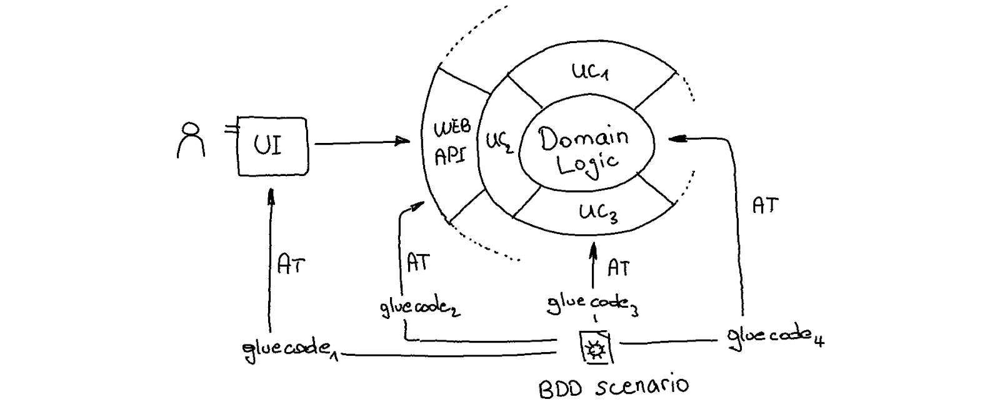

#### Remarks and recommendations

**Acceptance tests** (AT) are high-level integration tests defined at the feature level. Supported by natural language and Gherkin syntax, their self-documentation is accessible to all stakeholders and emphasises the implemented and tested behaviour, including its preconditions and postconditions. They usually cover functional requirements and may also test non-functional requirements. They should be applied to both the application architecture layer and the domain architecture layer.

**Contract tests** (CT) apply to the web infrastructure layer and check the implementation of the web API against the pre-existing API specification contract.

**Smoke tests** (ST) may be a subset of nominal acceptance tests to be played in the production environment to check the availability of the expected functional behaviour.

**xUnit tests** (UT/IT), due to their technical nature, do not resonate with all stakeholders and therefore do not provide evidence of which functional requirements are implemented and tested.

Examples:

- [Blueprint API — AT — API level](https://github.com/vondacho/arch-blueprint-kotlin/tree/master/src/acceptanceTest/kotlin/edu/obya/blueprint/client/at)
- [Blueprint API — AT — Domain level](https://github.com/vondacho/arch-blueprint-kotlin/tree/master/src/acceptanceTest/kotlin/edu/obya/blueprint/problemsolving/at)
- [Blueprint API — CT](https://github.com/vondacho/arch-blueprint-kotlin/tree/master/src/contractTest/kotlin/edu/obya/blueprint/client/cdc)
- [Blueprint API — UT/IT](https://github.com/vondacho/arch-blueprint-kotlin/tree/master/src/test/kotlin/edu/obya/blueprint/client)

### BDD and agility

**Agile ideology** influences methodologies that support iterative development in small increments, enabling quick feedback and adaptation.

Delivering the most valuable scenarios within one or more stories has a natural priority, and a further valuable set of scenarios can be delivered in subsequent increments.

Scenarios are developed against single acceptance tests, which can be executed by a continuous integration tool. This tooling can be configured to monitor which scenarios have been delivered and which ones are still under development. This promotes transparency and enables early feedback, reactions, and predictions leading up to the deadline.

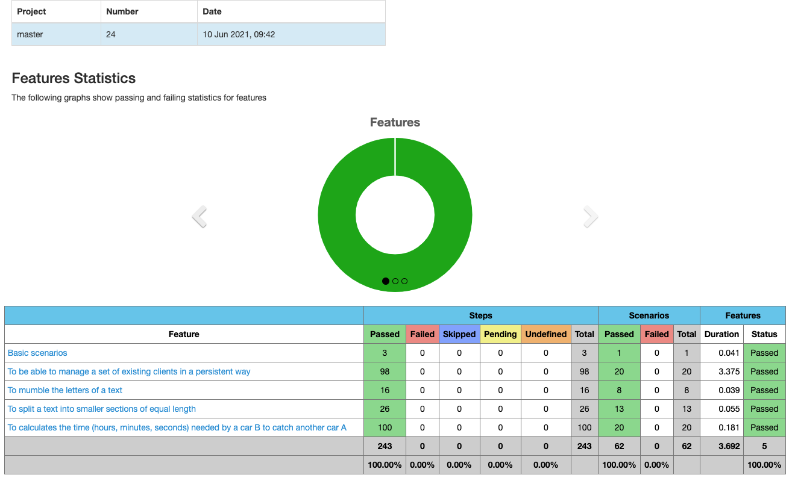

See the [Jenkins Cucumber Reports plugin](https://plugins.jenkins.io/cucumber-reports/).

### Living documentation

A BDD-driven specification and [Serenity BDD](https://serenity-bdd.github.io/docs/guide/user_guide_intro) tooling enable living documentation.

### Evidence of system well-being

With [Serenity BDD](https://serenity-bdd.github.io/docs/guide/user_guide_intro) test execution reports, auditors can be provided with proof that all requirements covered by the system in place are supported by documented, continuous acceptance tests. It supports Java technology only.

With [Allure](https://allurereport.org/) test execution reports, more evidence can be provided to auditors that testing is done in depth, even at lower levels of the test pyramid (e.g., component integration testing and component unit testing), and is uniformly applied across multiple technologies (Python/Java/Kotlin).

## Summary

### Outcomes

- A **common understanding** of expected system behaviour expressed in a domain-oriented ubiquitous language.
- The enhanced probability that **the implemented thing is the right one**.
- Human-readable, **contractual and executable specification** directly usable by every actor of the development team.
- Scenario-based, use-case-driven and domain-driven **documentation of system behaviour**.
- Scenario-based organisation and **monitoring of feature development**.
- Innovation brought to the **tester role** means the QA engineer can now have a significant impact on development.

### Costs

- Time: to attend, organise and facilitate Example Mapping meetings
- Time: to learn one new technique
- Time: to learn how to write BDD scenarios
- Time: to set up a BDD framework
- Time: to craft reusable glue code and test code
- Time + money: to maintain Gherkin phrasing, glue code and test code

*This technique should yield a sustainable investment in product quality.*

## Part 4 — BDD material

### Blueprints

Ready-to-use blueprints as BDD starters:

- [Kotlin BDD blueprint](https://github.com/vondacho/arch-blueprint-kotlin)
- Java BDD blueprint
- Java-Quarkus BDD blueprint

### Literature

- [Example Mapping](https://cucumber.io/blog/bdd/example-mapping-introduction/)
- [BDD in Action](https://www.manning.com/books/bdd-in-action-second-edition)
- [Serenity BDD guide](https://serenity-bdd.github.io/docs/guide/user_guide_intro)

### Links

- [Cucumber BDD framework](https://cucumber.io/)
- [Behave BDD framework](https://behave.readthedocs.io/)
- [Allure test reporting](https://allurereport.org/)
